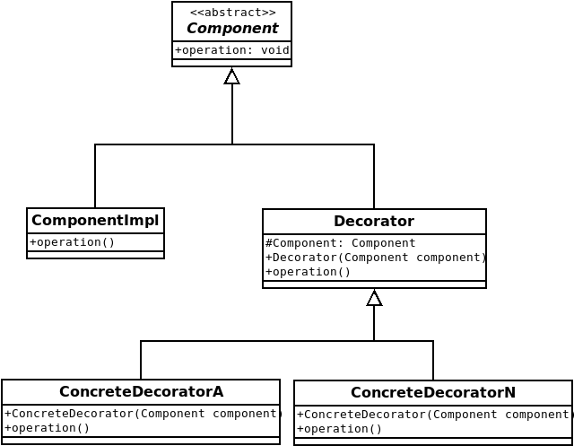

# Java 设计模式
更新时间：2018.08.03

目录
---
<!-- TOC depthFrom:2 updateOnSave:true -->

- [创建型模式](#创建型模式)
- [结构型模式](#结构型模式)
    - [装饰器模式(Decorator)](#装饰器模式decorator)
        - [角色](#角色)
        - [类图](#类图)
        - [运用实例](#运用实例)
- [行为型模式](#行为型模式)

<!-- /TOC -->

---


## 创建型模式

## 结构型模式

### 装饰器模式(Decorator)

#### 角色

* 基类（Component）
* 修饰器（Decorator）
* 修饰类（ConcreteDecorator）

#### 类图



#### 运用实例

抽象基类(或接口)

```java
public abstract class Component{
    
    /**
     * 被修饰的方法
     */
   abstract public void operation();

}
```

实现类

```java
public class ComponentImpl extends Component{
    
    public void operation(){
        System.out.println("Impl:do something...");
    }
    
}
```

修饰器继承抽象基类

```java
public class Decorator extends Component{

    /**
     * 聚合
     */
    protected Component component;

    public Decorator(Component component){
        this.component = component;
    }

    @Override
    public void operation(){
        component.operation()
    }
    
}
```
修饰类（n个）

```java
public class ConcreteDecoratorA extends Decorator{
    
    public ConcreteDecorator(Component component){
        super(component);
    }

    public void operation() {
        super.operation();
        System.out.println("A:do something...");
    }
    
}
```

运用场景
```java
//new 实现类
Component component = new ComponentImpl();
//new 修饰器
Decorator decorator = new Decorator(component);
//new 修饰类A ....N
decorator = new ConcreteDecoratorA(decorator);
decorator = new ConcreteDecoratorB(decorator);
decorator = new ConcreteDecoratorC(decorator);
...
decorator = new ConcreteDecoratorN(decorator);

//执行
decorator.operation();
```
执行结果如下
```
Impl:do something...
A:do something...
B:do something...
C:do something...
...
N:do something...
```

## 行为型模式