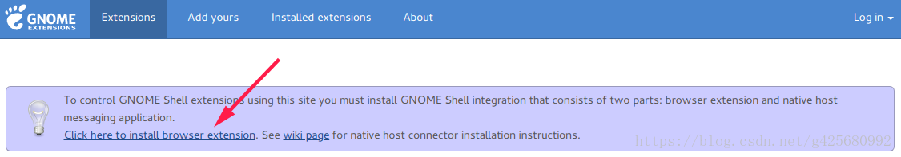
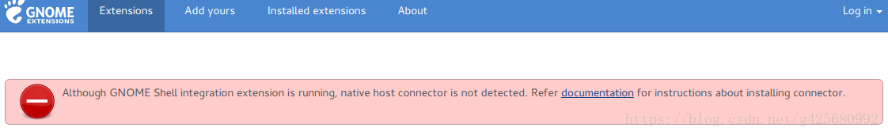

# Ubuntu 18.04 美化
更新时间:2018.06.06

目录
---

<!-- TOC depthFrom:2 updateOnSave:true -->

- [链接](#链接)
- [Terminal 美化](#terminal-美化)
- [Mac主题](#mac主题)
- [主题相关文件路径](#主题相关文件路径)
- [开机动画](#开机动画)

<!-- /TOC -->

## 链接

+ [GNMOE主题库](https://www.opendesktop.org/s/Gnome/browse/)
+ [GNMOE插件库](https://extensions.gnome.org/)

* 参考文章

    * [Ubuntu18.04（Gnome桌面）主题美化，Mac私人定制](https://blog.csdn.net/zyqblog/article/details/80152016#11-%E4%BD%95%E4%B8%BAgnome-shell-extensions-%E4%BB%A5%E5%8F%8A%E5%A6%82%E4%BD%95%E5%AE%89%E8%A3%85%E4%B8%8E%E5%BA%94%E7%94%A8)

## Terminal 美化

```sh
#安装 zsh
sudo apt install zsh
#安装 Oh-my-zsh 自动配置
sh -c "$(wget https://raw.github.com/robbyrussell/oh-my-zsh/master/tools/install.sh -O -)"
#切换道 zsh
chsh -s /bin/zsh 
```

## Mac主题
[参考链接](https://www.cnblogs.com/feipeng8848/p/8970556.html)

1. tweak tool

    ```sh
    sudo apt install gnome-tweak-tool
    sudo apt install gnome-shell-extensions
    ```

1. 插件安装

    浏览器下载插件
    

    安装插件后出现以下提示
    

    安装chrome-gnome-shell插件
    ```sh
    sudo apt install chrome-gnome-shell
    ```

1. 主题包
    + [MacOS High Sierra](https://www.opendesktop.org/s/Gnome/p/1013714/)

1. dock
    + 打开Ubuntu Software，直接搜索 dash to dock，安装上

## 主题相关文件路径

+ 主题包存放路径

    ```sh
    /usr/share/themes
    /usr/share/icons
    /usr/share/fonts
    ```

## 开机动画

+ 动画包路径
    ```sh
    /usr/share/plymouth/themes/
    ```

+ 修改配置文件(先备份)

    ```sh
    /etc/alternatives/default.plymouth
    ```
+ 修改[script]内文件路径
    ```sh
    [Plymouth Theme]
    Name=Ubuntu Logo
    Description=A theme that features a blank background with a logo.
    ModuleName=script

    [script]
    ImageDir=/usr/share/plymouth/themes/ubuntu-logo
    ScriptFile=/usr/share/plymouth/themes/ubuntu-logo/ubuntu-logo.script
    ```