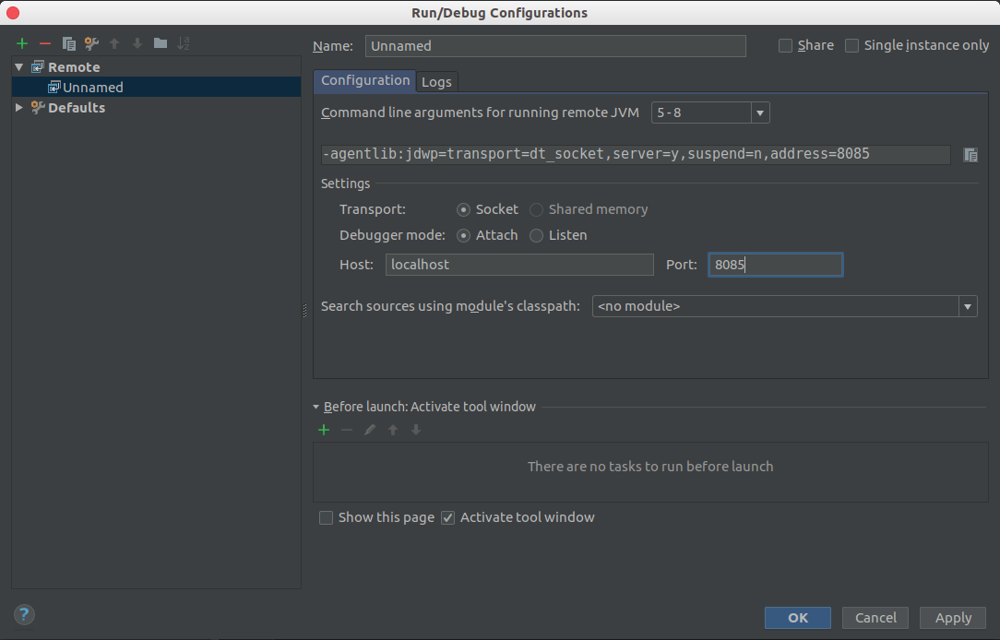

# Tomcat 知识
更新时间:2018.06.12

## 远程调试

### tomcat 配置

+ Windows

    在catalina.bat里加入：
    ```bat
    SET CATALINA_OPTS=-server -Xdebug -Xnoagent -Djava.compiler=NONE -Xrunjdwp:transport=dt_socket,server=y,suspend=n,address=8085
    ```
    8085为调试端口
    
+ Linux

    在catalina.sh里加入：
    ```sh
    CATALINA_OPTS="-server -Xdebug -Xnoagent -Djava.compiler=NONE -Xrunjdwp:transport=dt_socket,server=y,suspend=n,address=8085" 
    ```
    8085为调试端口

### IDE 配置

+ idea

    配置界面如下
    